# Complex Mermaid Diagrams

## Large Flowchart - E-Commerce Order Processing

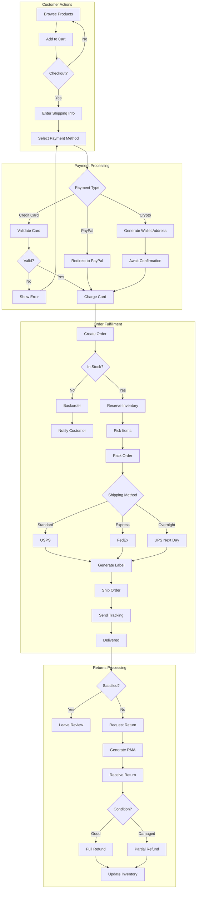

## State Diagram - WebSocket Connection

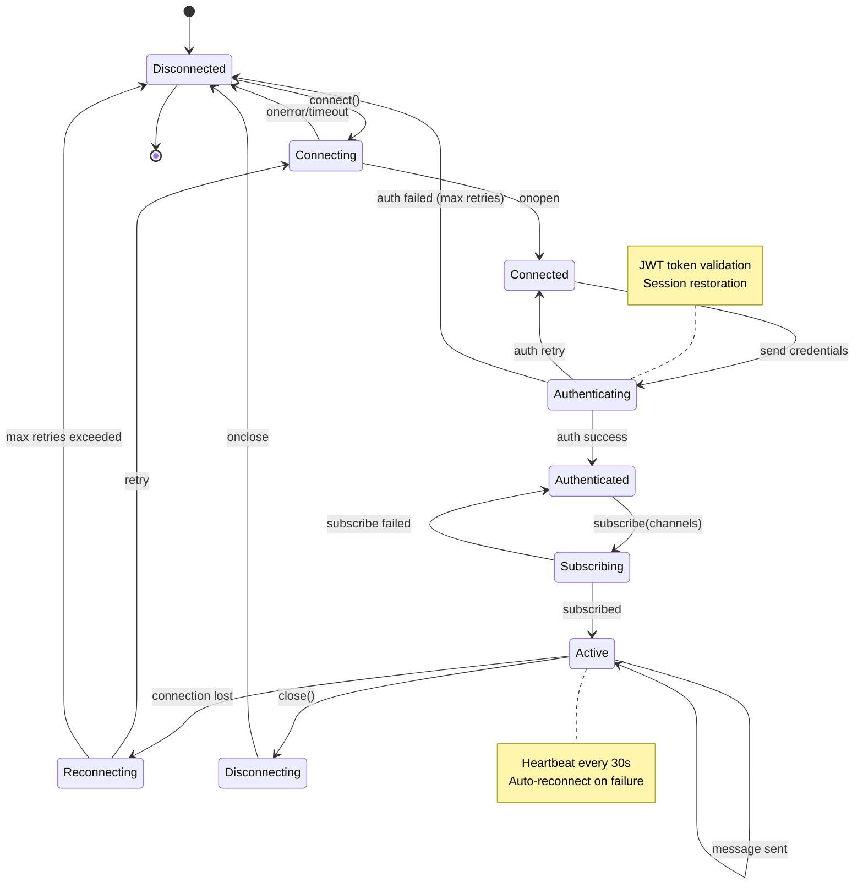

## Entity Relationship Diagram - Social Media Platform

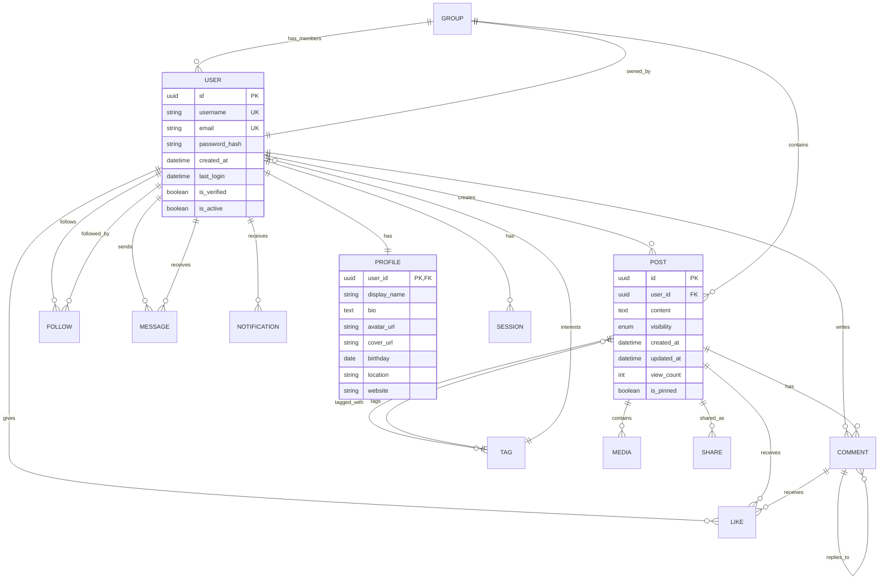

## Sequence Diagram - OAuth2 Authorization Code Flow

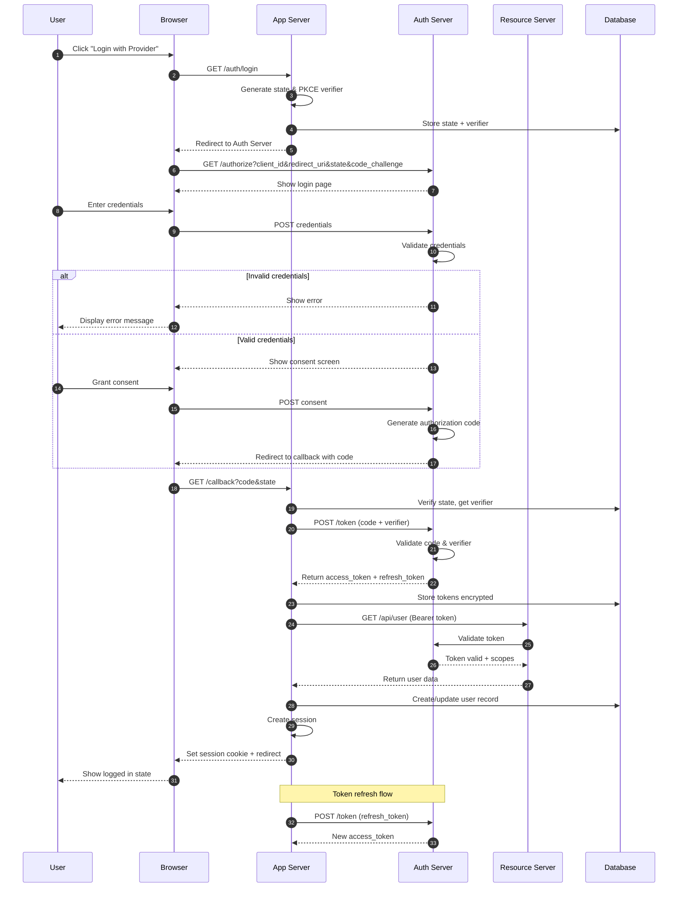

## Gantt Chart - Product Launch Timeline

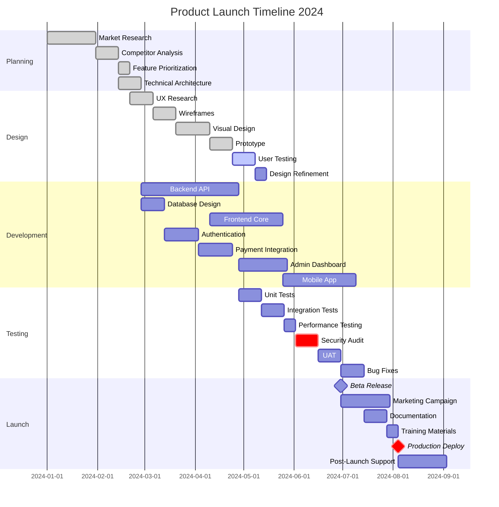

## Class Diagram - Game Engine Architecture

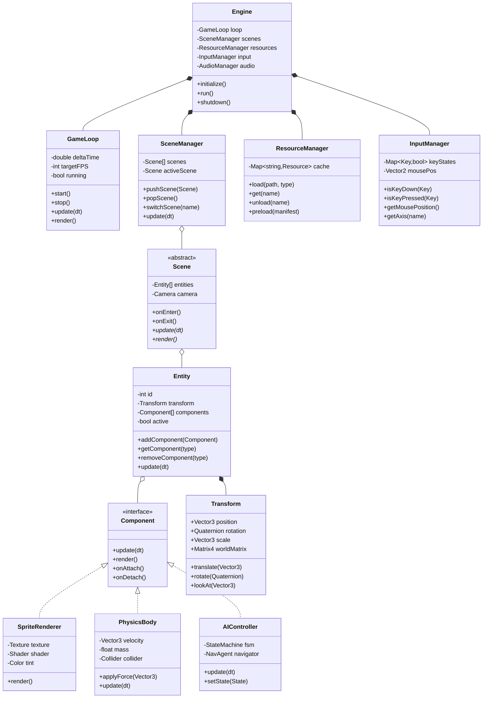

## Git Graph - Feature Branch Workflow

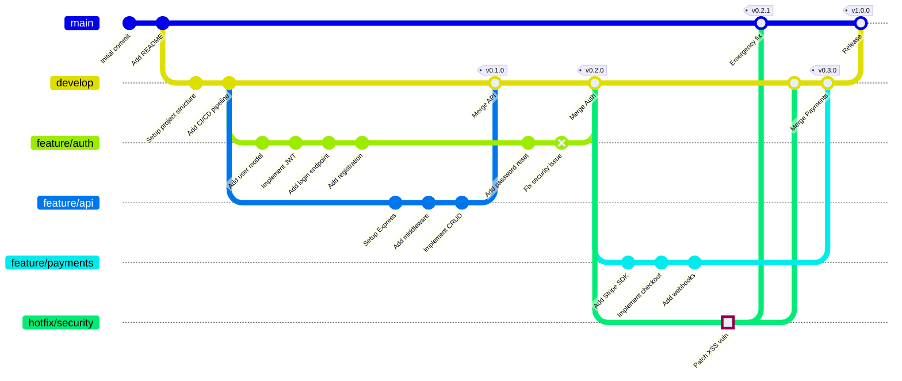

## Pie Chart - Budget Allocation

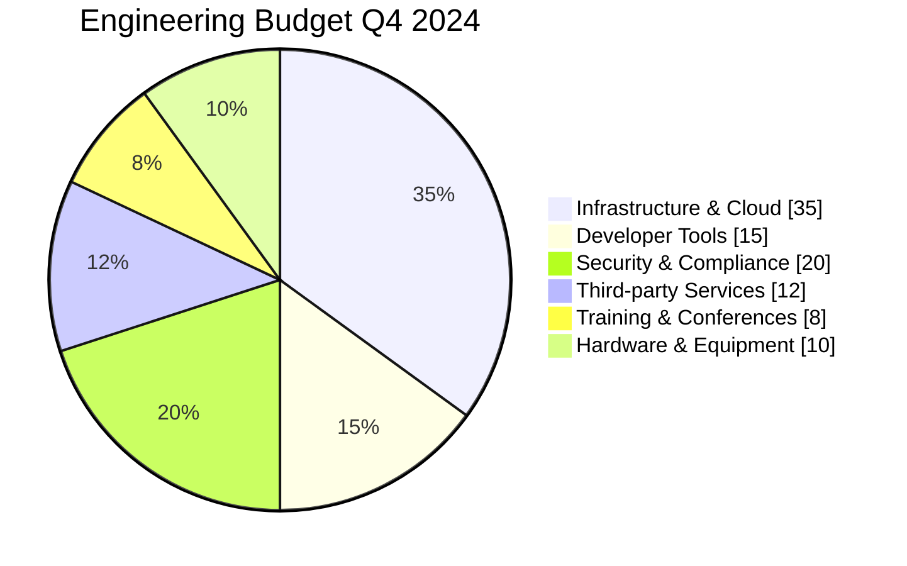

## Mindmap - System Design Concepts

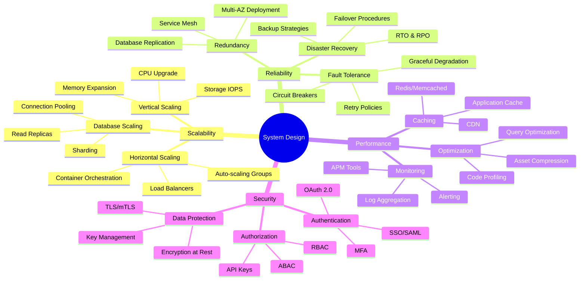

## Quadrant Chart - Technology Evaluation

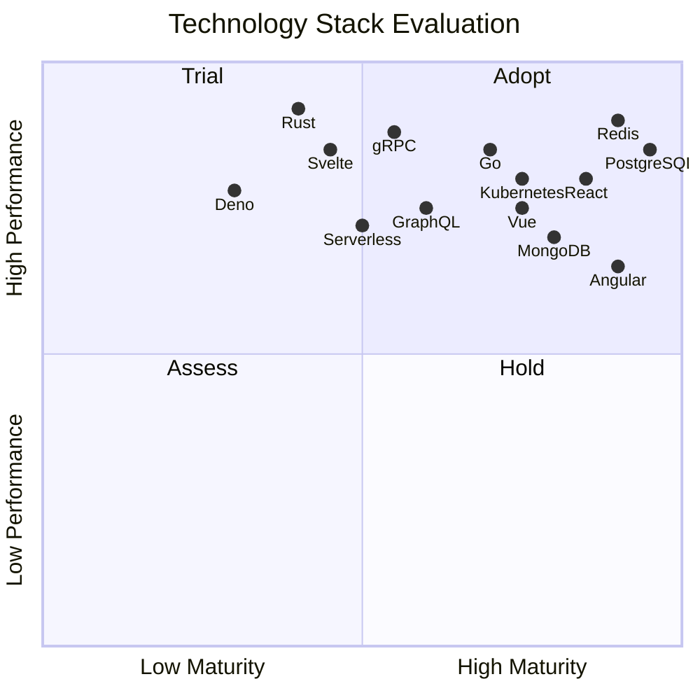

## Timeline - Company History

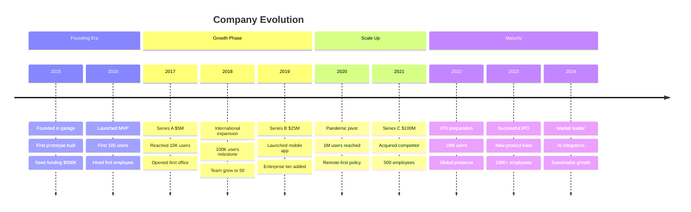
