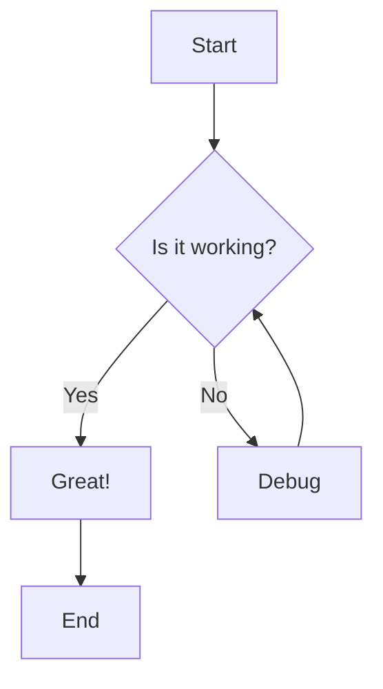
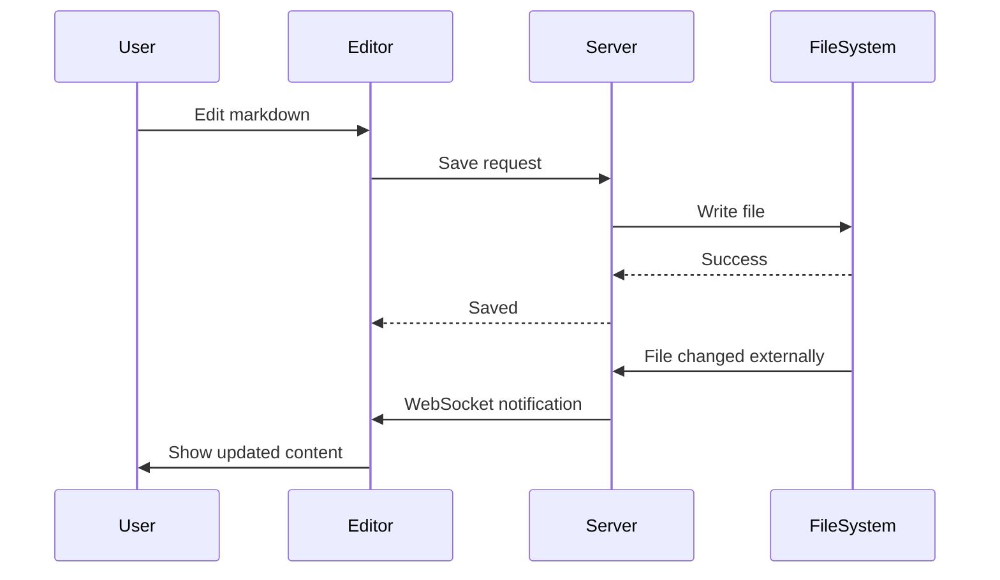
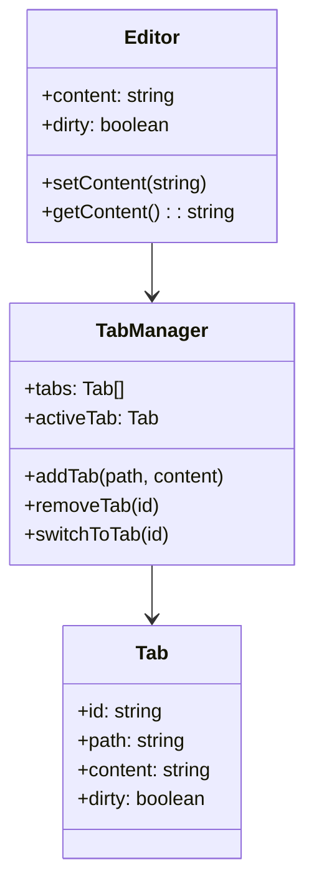

# Mermaid Markdown Editor Example

Welcome to the **Mermaid Markdown Editor**! This tool lets you edit markdown files with live preview and interactive mermaid diagrams.

## Features

- Real-time markdown preview
- Mermaid diagram rendering with pan and zoom
- Bidirectional file sync
- Multiple tabs support

## Flowchart Example



## Sequence Diagram



## Class Diagram



## Code Example

Here's some TypeScript code:

```typescript
function greet(name: string): string {
  return `Hello, ${name}!`;
}

console.log(greet("World"));
```

## Lists

### Unordered
- Item one
- Item two
- Item three

### Ordered
1. First
2. Second
3. Third

## Blockquote

> This is a blockquote. It can span multiple lines and contain **formatted** text.

## Table

| Feature | Status |
|---------|--------|
| Editor | Done |
| Preview | Done |
| Tabs | Done |
| Sync | Done |

---

*Edit this file to see live updates!*
